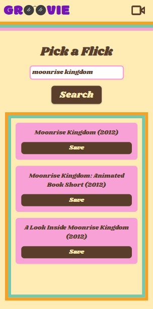
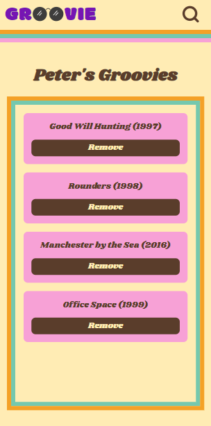

# 

Groovie Movie is a web app that allows you to search for movies and save your watch list.

_Ditch the movies note on your phone and save movies in style with Groovie._

## How it works

From the home screen you can navigate to the movie search page or your saved groovies (movies) page.

You'll be prompted to sign in if you do not already have a session.

Search for movies, and save them to your groovies.

View your saved groovies (movies).

Sign back in any time to check out your saved flicks!

## Tech stack

- Next.js
- NextAuth.js
- React
- Redux
- Styled Components
- Node.js
- PostgreSQL

## Team

[Laura](https://github.com/ldllano) | [Abhi](https://github.com/abitshaken) | [Spencer](https://github.com/s-baldwin) | [Peter](https://github.com/pmillspaugh)
